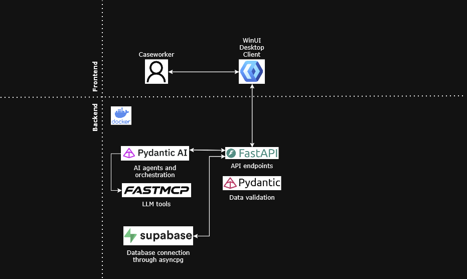
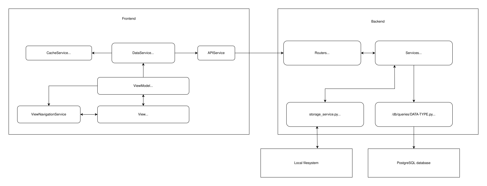

# Local LLM Assistant: Kristiansand Municipality

AI-assisted decision support for municipal caseworkers in the Plan og bygg department. A context-aware desktop client that lets case handlers query a local LLM for legal interpretation, dispensation assessments, and source referencing in building permit workflows.

---

## Description

This project is developed as a bachelor thesis at the University of Agder (UiA) in collaboration with Kristiansand Municipality. The system consists of a WinUI 3 desktop client and a FastAPI backend that routes requests to a locally hosted LLM. The client allows caseworkers to manage cases and chats, attach documents, and receive AI-generated responses grounded in Norwegian planning law. All processing happens locally within the municipality's infrastructure, no data is sent to external cloud services.

---

## Table of Contents

- [Tech Stack](#tech-stack)
- [Getting Started](#getting-started)
  - [Quickstart Guide](#quickstart-guide)
- [Architecture Diagram](#architecture-diagram)
- [Application Dataflow](#application-dataflow)
- [Handoff](#handoff)
- [Folder Structure](#folder-structure)
- [Authors](#authors)
- [Version History](#version-history)
- [License](#license)
- [Acknowledgments](#acknowledgments)

---

## Tech Stack

| Layer               | Technology                                |
| ------------------- | ----------------------------------------- |
| Desktop client      | WinUI 3 / C# (.NET 8)                     |
| Client architecture | MVVM — CommunityToolkit.Mvvm              |
| Backend API         | Python / FastAPI                          |
| Data validation     | Pydantic                                  |
| AI agent framework  | Pydantic AI                               |
| Tool protocol       | FastMCP (Model Context Protocol)          |
| LLM                 | OpenAI-compatible endpoint (Groq / local) |
| Database            | Supabase / PostgreSQL (asyncpg)           |

---

## Infrastructure and Build Dependencies

For a full list of Docker images, GitHub Actions, and build-time pulls, see [docs/technical/dependencies.md](docs/technical/dependencies.md).

---

## Getting Started

### Dependencies

**System requirements**

- Windows 10 / 11 (x64)
- [Visual Studio 2022](https://visualstudio.microsoft.com/) with workloads:
  - .NET Desktop Development
  - Windows App SDK / WinUI 3
- [.NET 8 SDK](https://dotnet.microsoft.com/en-us/download)
- [Python 3.11+](https://www.python.org/)
- Access to the internal LLM endpoint (`lokal-llm.geokrs.no`) or a compatible OpenAI-compatible endpoint
- Database schemas (found in `Backend\db\schema.sql`)

**Backend: Python packages** (`Backend/requirements.txt`)

| Package                                                     | Version | Purpose                                                |
| ----------------------------------------------------------- | ------- | ------------------------------------------------------ |
| [fastapi[standard]](https://fastapi.tiangolo.com)           | 0.132.0 | HTTP API framework                                     |
| [pydantic](https://docs.pydantic.dev)                       | 2.13.4  | Data validation and modelling                          |
| [pydantic-ai-slim](https://ai.pydantic.dev)                 | 1.96.0  | AI agent framework (with fastmcp, openai, groq extras) |
| [fastmcp](https://gofastmcp.com)                            | 3.2.4   | Model Context Protocol server                          |
| [asyncpg](https://github.com/MagicStack/asyncpg)            | 0.31.0  | Async PostgreSQL driver                                |
| [python-dotenv](https://github.com/theskumar/python-dotenv) | 1.2.2   | `.env` file loading                                    |
| [bcrypt](https://github.com/pyca/bcrypt)                    | 5.0.0   | Password hash verification                             |
| [pdfplumber](https://github.com/jsvine/pdfplumber)          | 0.11.9  | PDF text extraction                                    |
| [python-docx](https://python-docx.readthedocs.io)           | 1.2.0   | DOCX text extraction                                   |

**Frontend: NuGet packages** (`WindowsApplication/LocalLLMApp/LocalLLMApp.csproj`)

| Package                                                                                                                   | Version         | Purpose                                  |
| ------------------------------------------------------------------------------------------------------------------------- | --------------- | ---------------------------------------- |
| [Microsoft.WindowsAppSDK](https://learn.microsoft.com/en-us/windows/apps/windows-app-sdk/)                                | 1.8.260101001   | WinUI 3 runtime                          |
| [Microsoft.Windows.SDK.BuildTools](https://learn.microsoft.com/en-us/windows/apps/windows-app-sdk/)                       | 10.0.26100.7463 | Windows SDK build tools                  |
| [CommunityToolkit.Mvvm](https://learn.microsoft.com/en-us/dotnet/communitytoolkit/mvvm/)                                  | 8.4.0           | MVVM base classes, source generators, DI |
| [Microsoft.Extensions.DependencyInjection](https://learn.microsoft.com/en-us/dotnet/core/extensions/dependency-injection) | 10.0.2          | Dependency injection container           |
| [MimeTypeMapOfficial](https://github.com/samuelneff/MimeTypeMap)                                                          | 1.0.17          | File extension → MIME type mapping       |
| [StreamJsonRpc](https://github.com/microsoft/vs-streamjsonrpc)                                                            | 2.22.23         | JSON-RPC over streams (MCP client)       |
| [WinUI.TableView](https://github.com/w-ahmad/WinUI.TableView)                                                             | 1.3.4           | Table/grid control for WinUI 3           |

### Quickstart Guide

#### 1. Clone the repository

```powershell
git clone https://github.com/KrsGeodata/801_26_lokal-llm.git
cd 801_26_lokal-llm
```

#### 2. Configure environment variables

##### **Backend**

Open `Backend\.env.example` and fill in all values. Rename `.env.example` to `.env`. The required variables are:

| Variable              | Where to find it                                         |
| --------------------- | -------------------------------------------------------- |
| `OPENAI_API_KEY`      | Your LLM provider (e.g. Groq dashboard)                  |
| `LLM_BASE_URL`        | Your provider's OpenAI-compatible endpoint URL           |
| `LLM_MODEL`           | Model name supported by your provider                    |
| `SUPABASE_DB_URL`     | Supabase → Settings → Database → Connection string → URI |
| `SUPABASE_URL`        | Supabase → Settings → API → Project URL                  |
| `SUPABASE_KEY`        | Supabase → Settings → API → service_role key             |
| `STORAGE_DIR`         | Local path for uploaded files (e.g. `./local_storage`)   |
| `STORAGE_ENVIRONMENT` | A unique name for this machine (e.g. `local_Frank`)      |

##### **Frontend**

Open `WindowsApplication\LocalLLMApp\appsettings.local.example.json` and fill in all values. Rename `appsettings.local.example.json` to `appsettings.local.json`. The required variables are:

`{
  "BasicAuth": {
    "Username": "VM AUTH USERNAME",
    "Password": "VM AUTH PASSWORD"
  }
}`
| Variable | Where to find it |
| --------------------- | ------------------------------------------------|
| `Username` | Supplied separately by system owner |
| `Password` | Supplied separately by system owner |

#### 3. Set up the database

In the **Supabase Dashboard → SQL Editor**, paste and run the contents of [`Backend/db/schema.sql`](Backend/db/schema.sql) to create all tables and enums.
You can also populate the database with some seed data from [`Backend/db/seed.sql`](Backend/db/seed.sql) to get started,

#### 4. Set up and run the backend

```powershell
cd Backend

# Create and activate a virtual environment
python -m venv .venv
.venv\Scripts\Activate.ps1

# Install dependencies
python -m pip install --upgrade pip
pip install -r requirements.txt

# Start the development server
python -m uvicorn main:app --reload
```

The API will be available at `http://127.0.0.1:8000`. Open `http://127.0.0.1:8000/docs` to browse all endpoints.

#### 5. Run the frontend

1. Open `WindowsApplication\LocalLLMApp.sln` in **Visual Studio Code**
2. NuGet packages will restore automatically
3. Run the project (**F5**)

#### 6. Verify it works

| Check                                 | Expected result                                           |
| ------------------------------------- | --------------------------------------------------------- |
| `GET http://127.0.0.1:8000/`          | `{"status": "ok"}`                                        |
| `GET http://127.0.0.1:8000/health/db` | `{"db": "ok", "result": 1}`                               |
| Frontend login screen                 | Check if it accepts the auth credentials from users table |

---

## Architecture Diagram



---

## Application Dataflow



---

## Handoff

### Frontend

Two documents are prepared for the next development team. They are not required to run the application, but contain everything actionable for continuing the work.

| Document              | Location                                                        | Contents                                                                                                                 |
| --------------------- | --------------------------------------------------------------- | ------------------------------------------------------------------------------------------------------------------------ |
| Remaining Work        | [Handoff part one](docs/handoff/Handoff_frontend_part_one.docx) | Casemanager user test feedback, planned features, discovered bugs, and refactoring suggestions: sorted by page/component |
| Frontend Alternatives | [Handoff part two](docs/handoff/Handoff_frontend_part_two.docx) | Options for addressing WinUI rigidity (Avalonia, Uno, DevWinUI) and pluggable architecture based on input from Rune      |

### Backend

For backend there is one [Handoff backend document](docs/handoff/Handoff_backend.md) with a mix of ideas and thoughts for future development.

---

## Folder Structure

```
801_26_lokal_llm/
│
├── .github/                             # GitHub repository configurations
│   ├── ISSUE_TEMPLATE/                  # Templates for creating Bugs, Features, and Tasks
│   └── workflows/                       # CI/CD pipelines (GitHub Actions)
│
├── Backend/                             # Python FastAPI backend connecting to local LLM
│   ├── classes/                         # Python classes, likely Pydantic models for data validation/orchestration
│   ├── db/                              # Database integration (Supabase / PostgreSQL)
│   │   └── queries/                     # Specific SQL queries or ORM calls for the database
│   ├── docs/                            # Backend-specific documentation (e.g., how to run the venv/FastAPI server)
│   ├── mcp_tools/                       # Model Context Protocol (MCP) implementations for LLM tool use
│   │   └── agents/                      # AI agent logic and tool routing
│   ├── routers/                         # FastAPI endpoints (routes) separating API logic modularly
│   ├── services/                        # Backend business logic and orchestration layer
│   ├── main.py                          # Entry point for application
│   ├── fastmcp_server.py                # Define the MCP server that gets mounted on the main server, as well as all tools
│   └── requirements.txt                 # Specify dependencies
│
├── WindowsApplication/                  # Frontend Domain (.NET 8 & WinUI 3)
│    └── LocalLLMApp/                     # The main desktop client application
│        ├── Assets/                      # Static media (Splash screens, App icons, logos)
│        ├── Converters/                  # Converters of different kinds
│        │   ├── Json/                    # Json Value Converters (e.g. transform Null to Zero for parsed int values)
│        │   └── UI/                      # XAML Value Converters (translating complex data for UI binding)
│        ├── Docs/                        # Component-level documentation strictly matching code structure
│        ├── Models/                      # MVVM domain models representing data (Cases, Chats, Settings)
│        │   ├── ApiModels/               # Data models used in API calls
│        │   ├── EventArguments/          # Custom C# Event Args for passing data between internal components
│        │   └── Services/                # Data models specific to certain services (e.g. WindowsCaptureSnapshot.cs)
│        ├── Properties/                  # App startup configurations (e.g., launchSettings.json)
│        ├── Services/                    # Client business logic bridging UI and Backend (MCP Client, API calls)
│        ├── Themes/                      # Centralized XAML styling and ResourceDictionaries (Generic.xaml)
│        ├── UserControls/                # Reusable UI widgets (Attachment pills, chat messages, input boxes)
│        │   ├── Cases/                   # UserControls with specific relation to Cass
│        │   ├── Chats/                   # UserControls with specific relation to Chats
│        │   └── Files/                   # UserControls with specific relation to Files
│        ├── ViewModels/                  # MVVM layer handling view state, UI logic, and data binding
│        ├── Views/                       # Application Pages representing full screens (Chat, Case Overview, Login)
│        ├── App.xaml                     # The application entrypoints XAML
│        ├── App.xaml.cs                  # The application entrypoint
│        ├── MainWindow.xaml              # The primary application window
│        ├── MainWindow.xaml.cs           # Code behind file for the primary application window
│        └── appsettings.local.json       # Environment variables for the application
│
│
└── docs/                                # High-level repository documentation (architecture, backlog rules)
     ├── handoff/                         # Handoff specific documents
     ├── organizational/                  # Rules for how the team has worked + Bachelor rapport and presentation
     ├── supplemental                     # Supplementary documentation that does not fit in other categories
     └── technical                        # Documentation for overall technical and system related matter

```

---

## Authors

| Name                    | Contact                |
| ----------------------- | ---------------------- |
| Stine Strand            | stinestr@uia.no        |
| Jon Engravslia Aarebakk | jon.aarebakk@gmail.com |
| Frank Hovet             | frankh@uia.no          |
| Jørgen Ege              | jorgee17@uia.no        |
| Kata-Loore Tamm         | katalooret@uia.no      |

**Kristiansand Client/Supervisor:** Rune Ødegård og Dagfinn Øksendal
**UiA Supervisor:** Rania Fahim Hassan Ibrahim Elgazzar
**UiA Course Coordinator:** Hallgeir Nilsen, University of Agder

---

## Version History

- **PI3** (current)

- **PI2**

- **PI1**

---

## License

This project is developed in collaboration with Kristiansand Municipality. All results are encouraged to be made available under open-source licensing to benefit other municipalities and the wider Norwegian public sector. See project description for details on rights and collaboration.

---

## Acknowledgments

- Kristiansand Municipality, Plan og bygg: for domain expertise and access to end users
- CaseWorkers: primary end users and usability test participants
- University of Agder, Department of Information Systems
